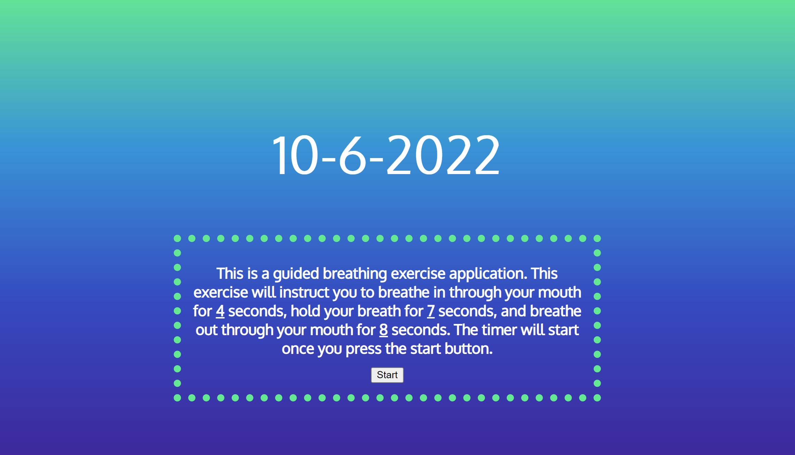
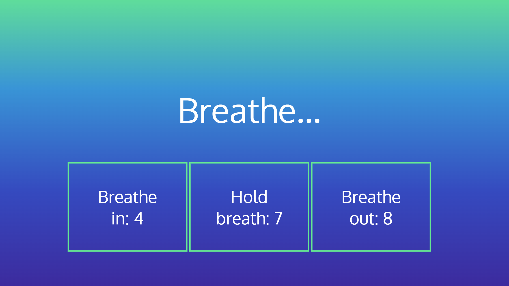

# Breathing-Exercises

[](https://www.javascript.com/)
[](https://opensource.org/licenses/MIT)
[](https://github.com/JoyUmoekpo/Breathing-Exercises/commit/main)
[](https://app.netlify.com/sites/breathing-exercises/deploys)

## Description

Welcome to Breathing Exercises! With this application, users can use a breathing exercise. After clicking the start button on the first page, the user will be directed to the breathing exercise page where a timer will guide them through a breathing exercise. This type of exercise is useful for those who feel overwhelmed or anxious or anyone else that wants to incorporate a breathing exercise into their day.

## Table of Contents

* [Technologies Used](#technologies-used)
* [Deployed Link](#deployed-link)
* [Features](#features)
* [Future Developments](#future-developments)
* [Application Images](#application-images)
* [Contributing](#contributing)
* [Tests](#tests)
* [Questions](#questions)
* [Credits](#credits)
* [License](#license)

## Technologies Used

* HTML
* CSS
* JavaScript

## Deployed Link

* This application is hosted on the netlify environment: [Breathing Exercises](https://breathing-exercises.netlify.app/)
* This is the repository link for this application: [Breathing Exercises Repository](https://github.com/JoyUmoekpo/Breathing-Exercises)

## Features

* One breathing exercise: 4 seconds of breathing in, 7 seconds of holding your breath, and 8 seconds of breathing out

## Future developments

* Different color themes
* Different breathing exercises

## Application Image(s)





## Contributing

* I'm open to contributions!

## Tests

* No tests were preformed.

## Questions

If you have any questions, feel free to contact me by using the information listed below:

* Github: <https://github.com/joyumoekpo>
* Email: joyumoekpo1@gmail.com

## Credits

* Centered Text: <https://blog.hubspot.com/website/center-div-css>
* Color gradient: <https://stackoverflow.com/questions/2869212/css3-gradient-background-set-on-body-doesnt-stretch-but-instead-repeats>
* Date Function:
<https://www.freecodecamp.org/news/javascript-get-current-date-todays-date-in-js/>,
<https://phoenixnap.com/kb/how-to-get-the-current-date-and-time-javascript>
* Unsplash Image / Favicon: <https://unsplash.com/photos/ROsXqvRzhiQ>

## License

### MIT License

```
Copyright (c) [2022] JoyUmoekpo

Permission is hereby granted, free of charge, to any person obtaining a copy
of this software and associated documentation files (the "Software"), to deal
in the Software without restriction, including without limitation the rights
to use, copy, modify, merge, publish, distribute, sublicense, and/or sell
copies of the Software, and to permit persons to whom the Software is
furnished to do so, subject to the following conditions:

The above copyright notice and this permission notice shall be included in all
copies or substantial portions of the Software.

THE SOFTWARE IS PROVIDED "AS IS", WITHOUT WARRANTY OF ANY KIND, EXPRESS OR
IMPLIED, INCLUDING BUT NOT LIMITED TO THE WARRANTIES OF MERCHANTABILITY,
FITNESS FOR A PARTICULAR PURPOSE AND NONINFRINGEMENT. IN NO EVENT SHALL THE
AUTHORS OR COPYRIGHT HOLDERS BE LIABLE FOR ANY CLAIM, DAMAGES OR OTHER
LIABILITY, WHETHER IN AN ACTION OF CONTRACT, TORT OR OTHERWISE, ARISING FROM,
OUT OF OR IN CONNECTION WITH THE SOFTWARE OR THE USE OR OTHER DEALINGS IN THE
SOFTWARE.
```
